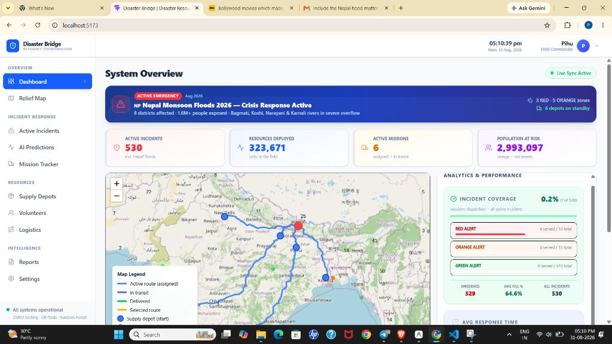
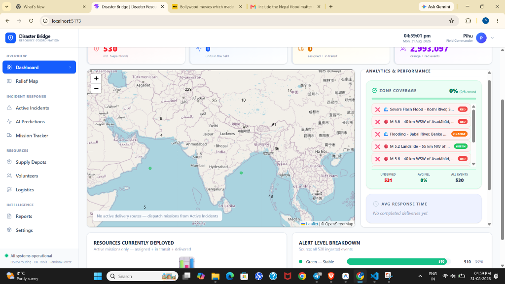
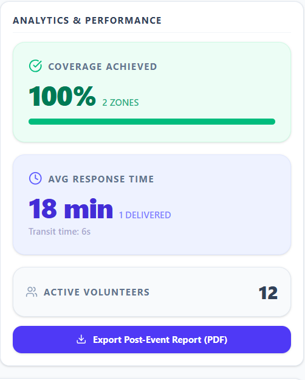

# Disaster Bridge: AI-Based Disaster Response Management System


Disaster Bridge is a state-of-the-art **AI-powered resource allocation and logistics platform** designed to bridge the gap between disaster occurrence and relief dispatch. By combining Machine Learning demand forecasting with advanced geospatial routing, it ensures that critical relief supplies (food, water, medical, shelter) reach affected populations as quickly and efficiently as possible.

<br>

<div align="center">
  
  <br><br>
  
  
</div>

<br>


## 🚀 Key Features

### 1. AI-Driven Demand Prediction
* **The Brain:** Utilizes a **Random Forest Regressor** (Machine Learning) to analyze incoming disaster events.
* **Smart Forecasting:** Automatically predicts the exact quantities of resources needed based on the disaster's severity, alert level, and population exposed.
* **Result:** Prevents both under-stocking and over-stocking in critical crisis zones.

### 2. Smart Logistics & Optimization
* **Geospatial Intelligence:** Uses **PostgreSQL + PostGIS** (`ST_Distance`) to calculate the exact real-world distances between supply depots and disaster zones.
* **Optimization Engine:** Integrates **Google OR-Tools** to solve complex resource allocation puzzles, prioritizing the nearest available depots to minimize transit time.
* **Result:** Generates optimized dispatch missions and routes in seconds.

### 3. Real-Time Geospatial Mapping
* **Live Tracking:** Built with **Leaflet.js**, the platform features a dynamic, interactive map.
* **Tactical View:** Visualizes disaster events with color-coded alert markers (Red, Orange, Green) and draws live, connected route lines from supply hubs to disaster sites for active missions.

### 4. Premium Analytics Dashboard
* **System-Wide Visibility:** Tracks incident coverage across hundreds of global disaster events.
* **Actionable Insights:** Monitors average resource fill percentages, average response transit times, and highlights unserved critical zones.
* **Modern UI:** Built with **React and Tailwind CSS** for a high-contrast, data-dense, and highly responsive user experience.

## 🛠️ Technology Stack

**Frontend:**
* React (TypeScript)
* Tailwind CSS (Styling & Animations)
* Vite (Build Tool)
* Leaflet.js / React-Leaflet (Mapping)
* Axios (API Communication)

**Backend:**
* Python
* FastAPI (High-performance API framework)
* SQLAlchemy (ORM)
* Scikit-Learn (Random Forest AI)
* Google OR-Tools (Constraint Programming)

**Database:**
* PostgreSQL
* PostGIS extension (for spatial/geographic queries)

## 📦 Local Development Setup

### 1. Database Setup
Ensure you have PostgreSQL installed with the PostGIS extension enabled.
```sql
CREATE DATABASE disaster_db;
\c disaster_db
CREATE EXTENSION postgis;
```

### 2. Backend Setup
Navigate to the `backend` directory:
```bash
cd backend
python -m venv venv
# Activate virtual environment
# Windows: venv\Scripts\activate
# Mac/Linux: source venv/bin/activate

pip install -r requirements.txt

# Run the server
uvicorn main:app --reload
```

### 3. Frontend Setup
Navigate to the `frontend` directory:
```bash
cd frontend
npm install
npm run dev
```
Access the dashboard at `http://localhost:5173`.

## 🌍 Case Study Highlights
During testing, this system was deployed against simulated data for the **2026 Nepal Monsoon Floods**. The system successfully ingested real-time flood alerts, quantified the massive population at risk (1.6M+), and autonomously routed massive hygiene and food requirements from cross-border Indian supply depots (Gorakhpur, Patna) directly to the affected zones in Nepal, drastically cutting down manual planning time.

---
*Built to save lives through data-driven decisions.*
