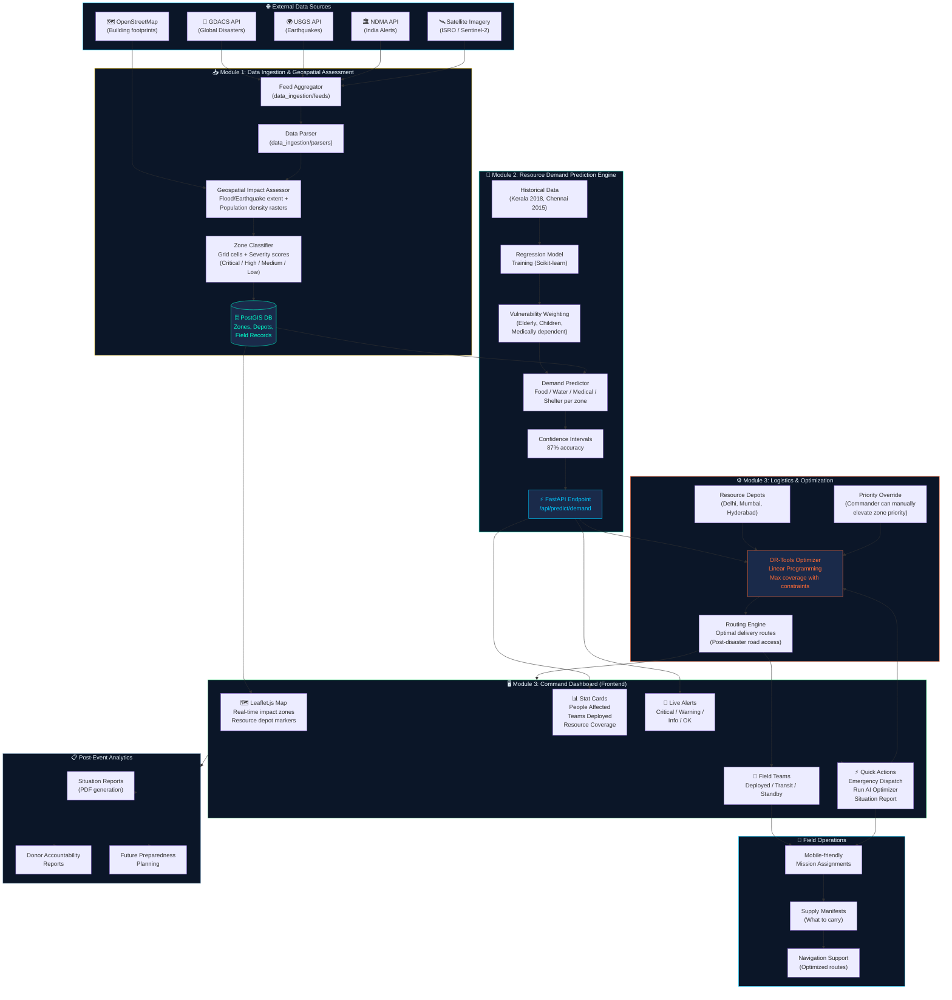
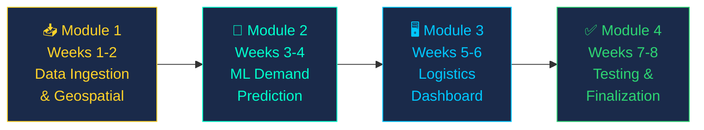

# 🚨 AI Disaster Response System — Project Flowchart & Structure

## 🗂️ Project Folder Structure

```
📁 Infosys Springboard 7.0/
│
├── 📁 frontend/                    ← React.js + Leaflet.js Dashboard
│   ├── 📁 public/
│   └── 📁 src/
│       ├── 📁 components/
│       │   ├── 📁 Map/             ← Leaflet map component
│       │   ├── 📁 Dashboard/       ← Stat cards, charts
│       │   ├── 📁 Alerts/          ← Live alerts panel
│       │   ├── 📁 ResourceCards/   ← Food, Medical, Transport cards
│       │   └── 📁 FieldTeams/      ← Team status tracker
│       ├── 📁 pages/               ← Route pages
│       ├── 📁 services/            ← API calls to backend
│       ├── 📁 hooks/               ← Custom React hooks
│       └── 📁 utils/               ← Helper functions
│
├── 📁 backend/                     ← FastAPI Python Server
│   ├── 📁 app/
│   │   ├── 📁 api/routes/          ← API endpoints
│   │   ├── 📁 models/              ← DB models (SQLAlchemy)
│   │   ├── 📁 schemas/             ← Pydantic schemas
│   │   ├── 📁 services/            ← Business logic
│   │   ├── 📁 core/                ← Config, security
│   │   └── 📁 db/                  ← Database connection
│   └── 📁 tests/
│
├── 📁 ml_engine/                   ← Machine Learning
│   ├── 📁 data/
│   │   ├── 📁 raw/                 ← Raw disaster datasets
│   │   └── 📁 processed/           ← Cleaned, feature-engineered
│   ├── 📁 notebooks/               ← Jupyter notebooks
│   ├── 📁 models/saved/            ← Trained .pkl model files
│   ├── 📁 scripts/                 ← Training scripts
│   └── 📁 evaluation/              ← Model evaluation reports
│
├── 📁 database/                    ← PostgreSQL + PostGIS
│   ├── 📁 migrations/              ← Alembic migration files
│   ├── 📁 seeds/                   ← Initial data
│   └── 📁 schemas/                 ← SQL schema definitions
│
├── 📁 optimizer/                   ← OR-Tools Optimizer
│   ├── 📁 algorithms/              ← LP/ILP algorithms
│   └── 📁 tests/
│
├── 📁 data_ingestion/              ← External API Connectors
│   ├── 📁 feeds/                   ← GDACS, USGS, NDMA feeds
│   ├── 📁 parsers/                 ← Data parsers
│   └── 📁 connectors/              ← API connector classes
│
├── 📁 docs/                        ← Documentation
│   ├── 📁 architecture/
│   ├── 📁 api_reference/
│   ├── 📁 flowcharts/
│   └── 📁 deployment/
│
├── 📁 tests/                       ← Integration & E2E Tests
├── 📁 scripts/                     ← Utility scripts
├── 📁 config/                      ← App configuration files
│
├── 📄 disaster_demo.html           ← Current UI Prototype ✅
├── 📄 docker-compose.yml           ← Docker services
├── 📄 .env.example                 ← Environment variables template
├── 📄 .gitignore
└── 📄 README.md
```

---

## 🔄 System Flowchart



---

## 🔀 Detailed Data Flow

```mermaid
sequenceDiagram
    participant EXT as 🌐 External APIs
    participant ING as 📥 Data Ingestion
    participant DB  as 🗄️ PostGIS DB
    participant ML  as 🤖 ML Engine
    participant OPT as ⚙️ Optimizer
    participant API as ⚡ FastAPI
    participant UI  as 🖥️ Dashboard
    participant FT  as 👥 Field Team

    EXT->>ING: Real-time disaster events (GDACS, USGS)
    ING->>ING: Parse & classify zones
    ING->>DB: Store impact zones + severity scores
    DB->>ML: Zone data + population density
    ML->>ML: Predict resource demand per zone
    ML->>API: Return demand estimates + confidence
    API->>OPT: Pass demand requirements
    OPT->>OPT: Linear programming optimization
    OPT->>API: Return allocation plan + routes
    API->>UI: WebSocket push (real-time updates)
    UI->>UI: Update map, alerts, stats
    UI->>FT: Send mission assignments
    FT->>API: Field reports (status updates)
    API->>ML: Recalibrate predictions
    API->>DB: Log all operations
```

---

## 📦 Module-wise Development Flow



---

## 🔑 Key API Endpoints (to be built)

| Method | Endpoint | Description |
|---|---|---|
| `GET` | `/api/zones` | All disaster zones with severity |
| `GET` | `/api/zones/{id}` | Single zone details |
| `POST` | `/api/predict/demand` | ML demand prediction for a zone |
| `GET` | `/api/resources` | Current resource inventory |
| `POST` | `/api/optimize` | Run OR-Tools optimizer |
| `GET` | `/api/routes` | Optimized delivery routes |
| `GET` | `/api/teams` | Field team statuses |
| `POST` | `/api/alerts` | Create new alert |
| `GET` | `/api/feeds/live` | Live disaster event feed |
| `GET` | `/api/reports/situation` | Generate situation report |
