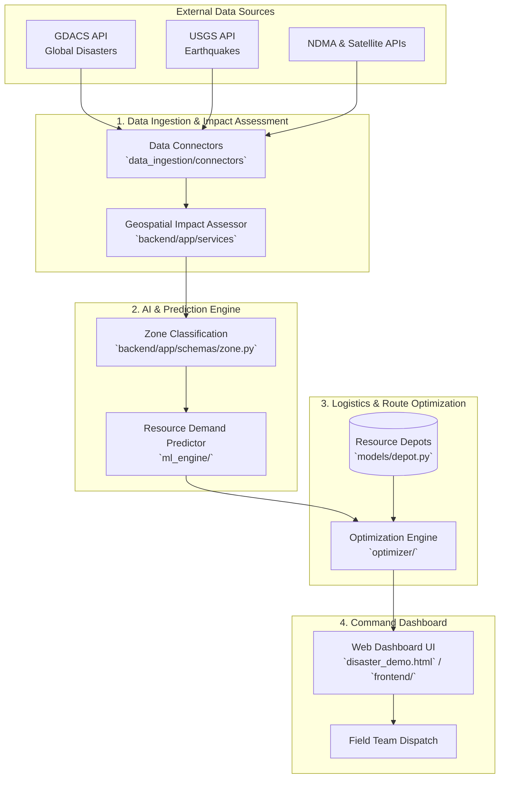

# Project Workflow: AI-Based Disaster Response Management System

This document outlines the end-to-end workflow of the Disaster Response Management platform.

## Architecture Flowchart

## Workflow Phases

### Phase 1: Data Ingestion & Impact Assessment
- **What happens:** The system actively listens to real-time APIs (like GDACS and USGS) to fetch disaster events. It combines this with satellite and population density data.
- **Key Modules:** `data_ingestion/connectors/gdacs_connector.py`, `backend/app/api/routes/feeds.py`

### Phase 2: Geospatial Zone Classification
- **What happens:** The disaster-affected area is divided into geographic grids (Zones). Each zone receives an impact severity score based on the damage extent.
- **Key Modules:** `backend/app/services/zone_classifier.py`, `backend/app/schemas/zone.py`

### Phase 3: Resource Demand Prediction (ML Engine)
- **What happens:** Using historical data and vulnerability weighting (e.g., population demographics), a regression model predicts the exact quantities of food, water, medical kits, and shelter needed for each specific zone.
- **Key Modules:** `ml_engine/` prediction scripts.

### Phase 4: Logistics Planning & Optimization
- **What happens:** The system cross-references the predicted demand with available supplies at various depots. An Operations Research (OR-Tools) optimization model allocates resources to maximize coverage and calculates the most efficient delivery routes considering road accessibility.
- **Key Modules:** `optimizer/`, `backend/app/models/depot.py`, `backend/app/api/routes/resources.py`

### Phase 5: Disaster Operations Dashboard
- **What happens:** The command center personnel view a comprehensive map displaying affected zones, resource allocations, and delivery routes. They can override priorities manually, generate reports, and dispatch field teams.
- **Key Modules:** `frontend/`, `disaster_demo.html`
